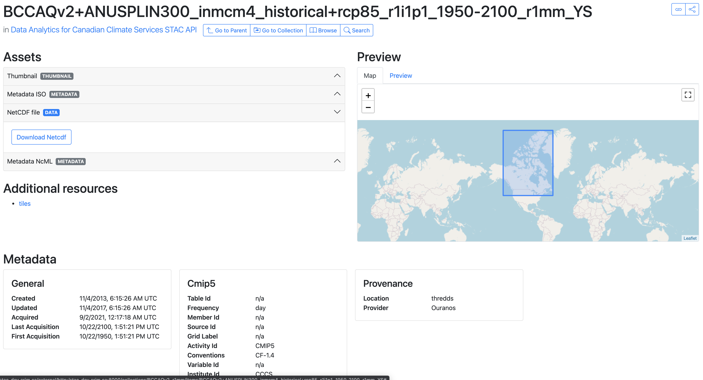

# STAC API Sandbox


Contains files and instructions to have a local STAC API environment ready for development.


1. Install the stack (see https://stac-utils.github.io/stac-fastapi/#installation)

```
git clone https://github.com/stac-utils/stac-fastapi.git
cd stac-fastapi/
conda create -y --name stac python=3.8
conda activate stac

pip install \
  -e stac_fastapi/api \
  -e stac_fastapi/types \
  -e stac_fastapi/extensions
pip install -e stac_fastapi/pgstac
```

2. Start the stack - STAC browser, postgres, proxy, blob store, and the prod STAC API

```
# inside stac-sandbox/
docker-compose build stac-browser
docker-compose build stac-app
docker-compose up -d
```

3. Start the STAC API in dev mode

```
# inside stac-sandbox/
source app/env.local; uvicorn app.stac_app:app --reload --host 0.0.0.0
```

4. Open `stac-browser`

```
# Dev STAC API listens on :8000
# Prod STAC API listens on :7000

# Dev and prod share the same PGStac db, started from `stac-fastapi`'s `docker-compose.yml`

# Access dev STAC API:
http://localhost:9090/external/http://mylocalip:8000
# Or remote dev STAC API
http://stac-dev.mydomain.ca/external/http://stac-dev.mydomain.ca:8000

# Access API docs
http://mylocalip:8000/docs
```


<hr/>


* To extend package during development, ¨pip install -e <pkg>`.

* If CQL operations seems not taken into account when doing `POST /search`, delete the `pgstac` database from Docker, then restart the db.

* To delete stac conda environment, `conda env remove --name stac`.

* `424 - Failed Dependency` relates to Postgres issue. Log the Postgres container to know why.

* `ImportError: cannot import name 'InvalidQueryParameter' from 'stac_fastapi.types.errors'` is due to installation issue with `stac-fastapi`. Try reinstalling the `stac_fastapi` dependencies.


<hr/>


## Test the stack

```
# inside stac-fastapi/
cd stac_fastapi/pgstac/tests/
source <PATH_TO_ENV_LOCAL>/env.local; pytest
```


<hr/>


## Screenshots

Sample view of the STAC browser interface.




